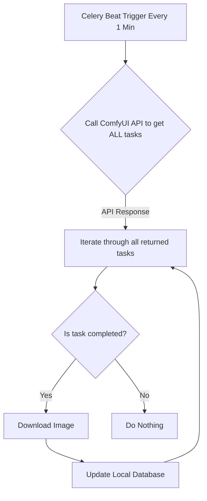
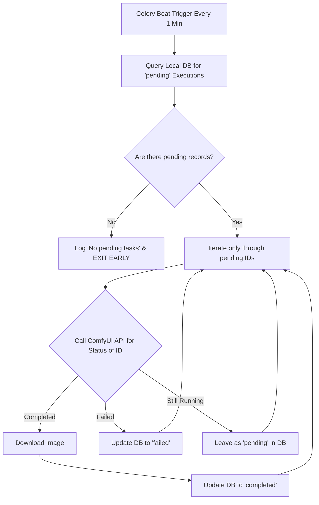

# Image Fetching Optimization Comparison

This document illustrates the background task architecture before and after implementing the database-first "pending" check optimization.

## Before Optimization (Naive Approach)

In the naive approach, the background task would unconditionally hit the external API (ComfyUI) every minute to ask "are you done with any images?", or try to poll everything. This is highly inefficient when the system is idle.

## After Optimization (Current Architecture)

In the optimized approach, the local database acts as the source of truth for what needs to be checked. The external API is only ever called if there is *known pending work*. When the system is idle, the task just performs a lightning-fast local DB query and sleeps.

### Key Differences:
1. **API Usage**: Before, the API was hit 1440 times a day minimum. Now, it's 0 times a day if the system is idle.
2. **Database Load**: Instead of scanning potentially thousands of completed tasks, it only looks for records explicitly marked as `pending`.
3. **Execution Time**: The early-exit `return` drops execution time from seconds down to milliseconds.